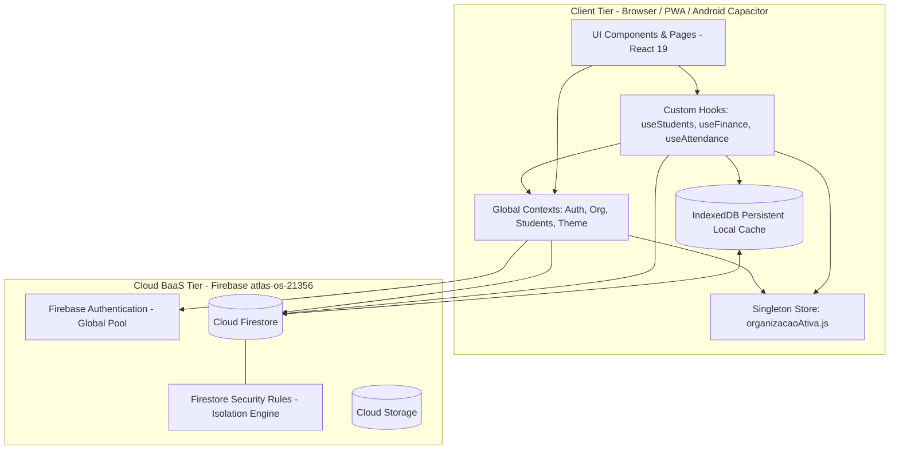

# ARTIFACT-03, ARTIFACT-04 & ARTIFACT-05 — Reconstrução e Conformidade Arquitetural

## FASE 2: Reconstrução Arquitetural (ARTIFACT-03)

### Diagrama da Arquitetura Efetivamente Observada

A arquitetura do Atlas Academy não adota Clean Architecture pura nem Arquitetura em Camadas tradicional com backend dedicado. O sistema opera como uma **Arquitetura "BaaS-Direct / Rich-Client SPA"** com particionamento multi-tenant lógico em nuvem.



---

## FASE 2: Mapa de Dependências Reais (ARTIFACT-04)

O grafo de dependências revela alto acoplamento em alguns módulos centrais e desvios de camada:

```
[Site (cadastro.html / quiz.js)]
 ├── Inicializa Firebase Compat SDK diretamente
 ├── Executa createUserWithEmailAndPassword
 ├── Escreve diretamente em organizations/{orgId}
 ├── Escreve diretamente em organizations/{orgId}/members/{uid}
 ├── Escreve diretamente em organizations/{orgId}/usuarios/{email}
 └── Redireciona via URL para [System (LoginPage)] passando email e pin em query string

[System (App.jsx)]
 ├── Provedores Encadeados: Theme → Auth → Organizacao → Students → Collaborators → App
 ├── Hooks Globais com Efeito Colateral: useNotificacoesPush, useNotificacoesApp
 └── Roteamento: Lazy loading de 19 módulos com ProtectedRoute

[useStudents.js (Hotspot Central)]
 ├── Depende de AuthContext (para obter dados do usuário logado)
 ├── Depende de OrganizacaoContext (para obter organizacaoAtualId)
 ├── Depende de StudentsContext (para consumir lista de alunos)
 ├── Inicializa uma instância oculta de Auth (vAuth) via inMemoryPersistence
 ├── Executa mutações em:
 │    ├── organizations/{orgId}/usuarios/{id}
 │    ├── organizations/{orgId}/usuarios/{id}/privado/segredos (grava PIN puro)
 │    ├── organizations/{orgId}/modalidades/{mId}/turmas/{tId} (incrementa alunos)
 │    ├── organizations/{orgId}/members/{uid} (cria membership de aluno)
 │    ├── organizations/{orgId}/faturas/{id} (cria fatura inicial PAGA)
 │    └── organizations/{orgId}/logs/{id} (auditoria)
 └── Executa Hard Delete com cascata manual incompleta

[useFinance.js]
 ├── Escuta faturas e despesas via onSnapshot
 ├── Calcula KPIs em memória usando ponto flutuante binário
 └── Executa addDoc / updateDoc / deleteDoc diretamente sem tabela de pagamentos/auditoria
```

---

## FASE 2: Matriz de Conformidade Arquitetural (ARTIFACT-05)

| Regra Arquitetural Declarada | Comportamento Esperado | Comportamento Encontrado no Código | Status | Evidência Direta |
| :--- | :--- | :--- | :--- | :--- |
| **Isolamento de Tenants (Multi-Tenancy)** | Nenhuma academia lê ou escreve dados de outra. | As Security Rules validam `isOrganizationMember(orgId)` com base na subcoleção `members/{uid}`. No entanto, contas de autenticação compartilham o mesmo pool global do Firebase Auth. | ⚠️ **CONDICIONAL** | `firestore.rules` (linhas 66-74), `useStudents.js` (linhas 414-420) |
| **Atomicidade de Operações Críticas** | Criação de organização, cadastro de aluno e faturamento inicial indivisíveis. | Operações multi-documento são executadas em chamadas sequenciais `await setDoc() / await addDoc()` separadas, sem `runTransaction()` ou `writeBatch()`. | ❌ **NON-CONFORMANT** | `OrganizacaoContext.jsx` (linhas 192-207), `useStudents.js` (linhas 365, 371, 428, 478) |
| **Segurança de Segredos (PINs)** | PINs armazenados com hash criptográfico (bcrypt/Argon2id) ou delegados estritamente ao Firebase Auth. | PINs administrativos e de alunos são armazenados em **texto puro** no Firestore dentro de `usuarios/{id}/privado/segredos` e manipulados em memória. | ❌ **CRITICAL VIOLATION** | `AuthContext.jsx` (linha 349-350), `useStudents.js` (linha 371-374), `Site/cadastro.html` (linha 148-151) |
| **Zero-Trust Client-Side** | O frontend não decide privilégios nem substitui a validação do servidor. | `effectiveRole` no `AuthContext` aceita override direto do `localStorage.getItem('rs_simulated_role')`, alterando o comportamento do `ProtectedRoute`. | ❌ **NON-CONFORMANT** | `AuthContext.jsx` (linhas 66-68, 96-97), `ProtectedRoute.jsx` (linhas 16-23) |
| **Imutabilidade de Histórico Financeiro** | Pagamentos devem gerar registros contábeis imutáveis. | `atualizarStatusCobranca` em `useFinance.js` apenas sobrescreve o campo `status: 'paid'` no documento da fatura; não há tabela/subcoleção de histórico de pagamentos. | ❌ **NON-CONFORMANT** | `useFinance.js` (linhas 128-139) |
