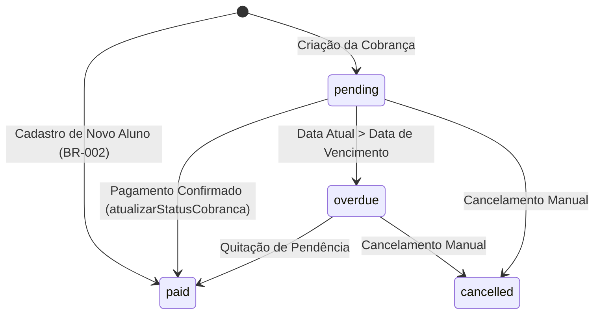
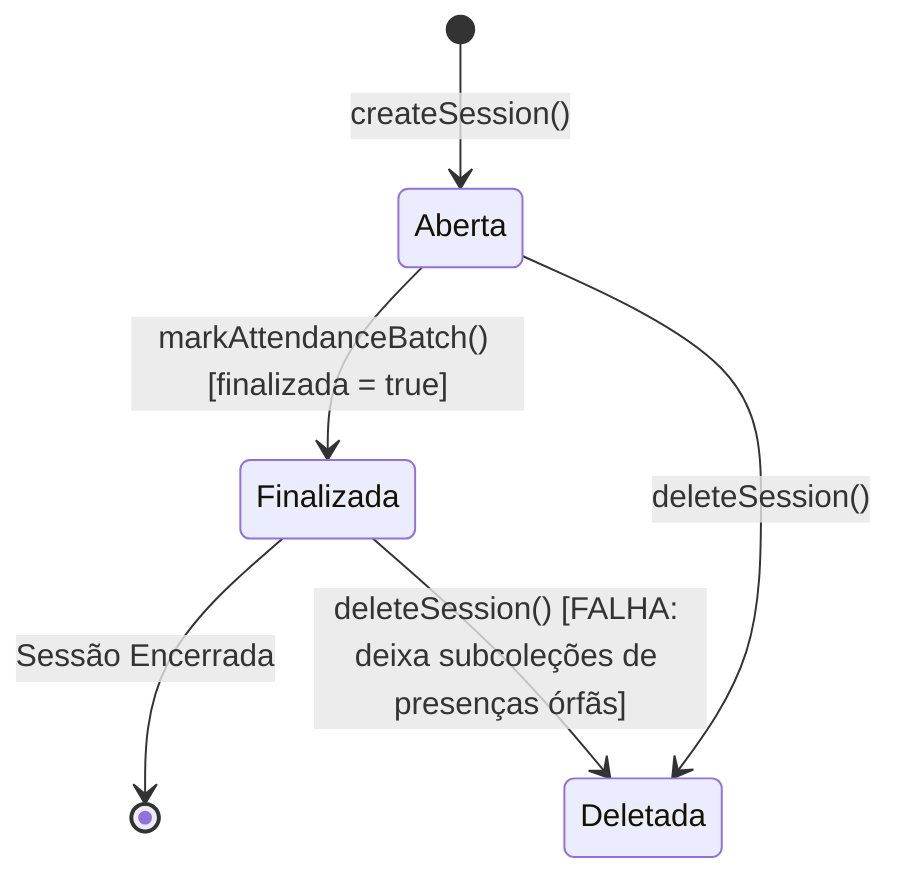

# ARTIFACT-06, ARTIFACT-07, ARTIFACT-08 & ARTIFACT-09 — Domínio, Regras e Invariantes

## FASE 3: Modelagem do Domínio (ARTIFACT-06)

O domínio central do Atlas é a **Gestão de Academias de Luta e Artes Marciais (Martial Arts Academy Management)**.

| Conceito de Domínio | Tipo | Responsabilidade | Regras Associadas | Evidência Direta no Código |
| :--- | :--- | :--- | :--- | :--- |
| **Organização (Tenant)** | Entidade Raiz / Aggregate Root | Representa a academia franqueada ou independente | Possui status (`ativo`/`inativo`), `ownerUid`, plano e configurações globais | `System/firestore.rules` (linhas 122-131), `OrganizacaoContext.jsx` |
| **Membro (Staff/Equipe)** | Entidade | Representa a relação de trabalho/vínculo institucional com a academia | Possui papéis (`owner`, `admin`, `gestor`, `professor`, `aluno`). Decide autorização no banco. | `System/firestore.rules` (linhas 133-145), `collections.js` |
| **Usuário (Pessoa)** | Entidade | Representa o praticante ou colaborador | Dados pessoais, contato de emergência, histórico médico, status de matrícula | `System/src/modules/students/StudentsPage.jsx`, `useStudents.js` |
| **Jornada Técnica** | Objeto de Valor (Value Object) | Controla a progressão marcial do aluno | Faixa atual (`white`, `blue`, `purple`, etc.), graus (0 a 4), contador de aulas assistidas desde a última graduação | `System/src/data/beltConfig.js`, `useStudents.js` (linhas 338-348) |
| **Chamada / Sessão** | Entidade / Agregado | Sessão de treino ou aula em data/hora específica | Contém contadores agregados (`presencasCount`, `faltasCount`, `visitantesCount`), lista de presenças em subcoleção | `attendanceService.js` (linhas 38-47, 70-130) |
| **Fatura / Cobrança** | Entidade | Registro de cobrança de mensalidade ou plano | Status (`pending`, `paid`, `overdue`), valor, data de vencimento, mês de referência | `useFinance.js`, `billingUtils.js`, `billingAdjustment.js` |
| **Modalidade & Turma** | Entidade | Disciplina marcial (ex: Jiu-Jitsu, Boxe) e suas turmas com horários e capacidade | Possui grade de horários, professor responsável e lista de alunos matriculados com contagem | `useModalities.js`, `ModalitiesPage.jsx` |

---

## FASE 3: Catálogo de Regras de Negócio (ARTIFACT-07)

### BR-001: Isolamento Estrito de Dados por Academia
- **Descrição:** Nenhum dado de aluno, finanças, chamadas ou equipe pode ser lido ou modificado por membros de outra organização.
- **Implementação:** `System/firestore.rules` (função `isOrganizationMember(orgId)`).
- **Validação:** Firestore Security Rules no servidor.
- **Persistência:** Todos os documentos são subcoleções de `organizations/{orgId}`.
- **Status:** **PROVEN** (com ressalva de segurança em consultas globais do Firebase Auth).

### BR-002: Faturamento Inicial Automático do Aluno
- **Descrição:** Todo novo aluno matriculado é registrado automaticamente com a primeira mensalidade com status "paid" (PAGA) e o próximo vencimento projetado para 1 mês à frente.
- **Implementação:** `System/src/hooks/useStudents.js` (linhas 453-496).
- **Validação:** Executada client-side dentro de `addStudent()`.
- **Persistência:** `organizations/{orgId}/faturas`.
- **Status:** **PROVEN** (Vulnerável: se a chamada falhar ou a conexão cair entre a criação do aluno e a da fatura, o aluno é criado sem fatura).

### BR-003: Incremento de Aulas na Presença e Progressão de Faixa
- **Descrição:** Ao finalizar a chamada (`markAttendanceBatch`), todo aluno marcado como `present` tem seu contador `aulas_desde_ultima_graduacao` e `total_visitas` incrementado em 1.
- **Implementação:** `System/src/services/attendanceService.js` (linhas 103-111).
- **Validação:** Batch Firestore atômico com `increment(1)`.
- **Persistência:** `organizations/{orgId}/usuarios/{id}`.
- **Status:** **PROVEN**.

### BR-004: Restrição de PIN de Acesso
- **Descrição:** O PIN de acesso para alunos e gestores deve conter exatamente 6 dígitos numéricos.
- **Implementação:** `System/src/modules/auth/LoginPage.jsx` (linhas 89-91, 109-112), `Site/js/quiz.js` (linhas 369-382), `System/firestore.rules` (linha 178).
- **Validação:** Validação client-side e Security Rules (`matches('[0-9]{6}')`).
- **Status:** **PROVEN**.

---

## FASE 3: Registro de Invariantes (ARTIFACT-08)

| ID | Invariante do Negócio | Onde é Protegido? | Protegido no Banco? | Protegido na Aplicação? | Nível de Risco |
| :--- | :--- | :--- | :--- | :--- | :--- |
| **INV-001** | Um aluno só pode pertencer e ser listado dentro da academia onde foi matriculado. | `firestore.rules` + `useColecaoComTenant.js` | **SIM** (Rules) | **SIM** (Context) | **BAIXO** |
| **INV-002** | O total de presenças de uma chamada deve ser exatamente igual à soma de alunos marcados com status `present`. | `attendanceService.js` (linhas 79-82, 123) | **NÃO** | **SIM** (Apenas em memória antes do commit) | **MÉDIO** |
| **INV-003** | O PIN de segurança de um usuário não pode ser acessível a outros alunos comuns. | `firestore.rules` (linhas 174-179) | **SIM** (`privado/segredos`) | **NÃO** (Gravado em texto plano) | **ALTO** |
| **INV-004** | A deleção de uma sessão de chamada deve reverter as presenças e a contagem de aulas dos alunos. | **NÃO IMPLEMENTADO** | **NÃO** | **NÃO** (`deleteSession` em `attendanceService.js` apenas deleta a chamada) | **CRÍTICO** (Corrupção de histórico de graduação) |
| **INV-005** | Alunos comuns não podem acessar rotas e relatórios financeiros (`/financeiro`, `/despesas`, `/relatorios`). | `firestore.rules` (linhas 225-240) + `ProtectedRoute.jsx` | **SIM** (Rules barram leitura direta) | ⚠️ **VULNERÁVEL** (`simulatedRole` em `localStorage` bypassa o guard de UI) | **ALTO** |

---

## FASE 3: Máquinas de Estado (ARTIFACT-09)

### 1. Ciclo de Vida da Fatura (Cobrança)

* **Condição de Falha Identificada:** A transição `pending` → `overdue` é calculada de forma volátil em memória via `useFinance.js` (`dueDate < todayStr`) usando UTC, sem persistência do estado no documento Firestore.

### 2. Ciclo de Vida da Chamada (Sessão de Aula)

