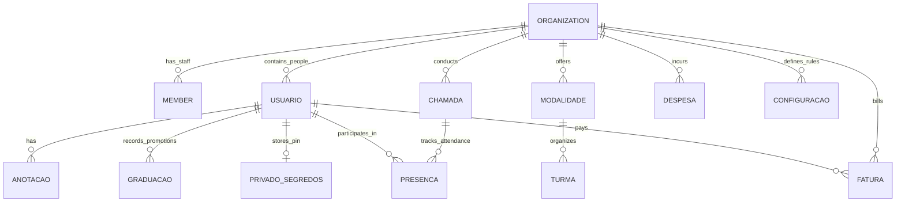

# EOS ARTIFACTS 10 a 14: CONTRATOS, MODELO DE DADOS, RISCOS DE CONSISTÊNCIA E LIMITES TRANSACIONAIS

**Sistema:** Atlas Academy (SaaS Multi-Tenant)  
**Módulos:** `System` (React 19 + Vite) & `Site` (Vanilla JS/HTML/CSS)  
**Modo:** `REVIEW_READ_ONLY` (Evidence-First)  
**Data:** 09/09/2026  
**Avaliador:** Revisor Sênior de Engenharia de Software (EOS Platform)

---

## ARTIFACT-10: Contract Registry (Registro de Contratos e DTOs)

No Atlas Academy não existe uma camada formal de schemas (ex.: Zod, Yup, Valibot, TypeScript interfaces ou Protocol Buffers). Todos os contratos são implícitos em objetos JavaScript planos (POJOs), gerando divergências semânticas graves entre escrita e leitura.

### 1. Entidade: Usuário / Membro (`organizations/{orgId}/usuarios/{uid}`)

| Propriedade | Tipo | Obrigatório | Local de Escrita | Local de Leitura | Risco de Quebra |
| :--- | :--- | :---: | :--- | :--- | :--- |
| `nome` / `name` | `string` | Sim | `OrganizacaoContext.jsx:177`, `useStudents.js` | `StudentsPage.jsx`, `LoginPage.jsx` | Médio: duplicidade de chave (`nome` vs `name`). |
| `email` | `string` | Sim | `OrganizacaoContext.jsx:176` | `AuthContext.jsx:183` | Baixo (padronizado com lowercase). |
| `role` / `papeis` / `roles` | `string` / `map` | Sim | `OrganizacaoContext.jsx:179-181` | `AuthContext.jsx:102-120` | Alto: tripla redundância com prioridades conflitantes. |
| `jornada_tecnica` vs `tech_journey` | `map` | Não | `attendanceService.js:109` (`jornada_tecnica`) | `useStudentJourney.js:80` (`tech_journey`) | **Crítico: mismatch de nome impede cálculo de graduação.** |
| `total_visitas` | `number` | Não | `attendanceService.js:107` | `StudentDetailsModal.jsx` | Médio: sem rollback em deleção de chamada. |
| `status` | `string` | Sim | `OrganizacaoContext.jsx:182` | `StudentsPage.jsx`, `useStudents.js` | Médio: inconsistência de caixa (`'Ativo'` vs `'ativo'`). |

### 2. Entidade: Sessão de Chamada (`organizations/{orgId}/chamadas/{id}`)

| Propriedade | Tipo | Obrigatório | Local de Escrita | Local de Leitura | Risco de Quebra |
| :--- | :--- | :---: | :--- | :--- | :--- |
| `id` | `string` | Sim | `attendanceService.js:50` | `AttendancePage.jsx` | Baixo. |
| `seqId` | `number` | Não | `attendanceService.js:41` (`Date.now()`) | `AttendancePage.jsx` | Médio: gerado client-side por concatenação de minutos/segundos. |
| `presencasCount` | `number` | Sim | `attendanceService.js:123` | `AttendancePage.jsx` | Médio: atualizado por snapshot agregado client-side. |
| `finalizada` | `boolean` | Sim | `attendanceService.js:128` | `AttendancePage.jsx` | Baixo. |
| `data` / `date` | `string` | Sim | `attendanceService.js:93` | `AttendancePage.jsx` | Médio: duplicidade de chaves legadas. |

### 3. Entidade: Fatura / Cobrança (`organizations/{orgId}/faturas/{id}`)

| Propriedade | Tipo | Obrigatório | Local de Escrita | Local de Leitura | Risco de Quebra |
| :--- | :--- | :---: | :--- | :--- | :--- |
| `studentId` | `string` | Sim | `useFinance.js:121` | `usePaymentReport.js:86`, `Security Rules` | Alto: se nulo, quebra Security Rules (`ehDonoDoRegistro`). |
| `amount` | `number` | Sim | `useFinance.js:124` | `useFinance.js:104` | Médio: parse `Number(amount)` pode resultar em `NaN`. |
| `dueDate` | `string` (`YYYY-MM-DD`) | Sim | `useFinance.js:121` | `useFinance.js:99`, `usePaymentReport.js:11` | **Crítico: comparado contra UTC em timezone BR (UTC-3).** |
| `status` | `string` | Sim | `useFinance.js:130` (`'paid'`, `'pending'`, `'overdue'`) | `useFinance.js:98` | Baixo. |
| `modalityName` / `turmaName` | `string` | Não | Implícito | `usePaymentReport.js:81-110` | Alto: falta retroativa exige join manual em memória com `usuarios`. |

---

## ARTIFACT-11: API Contract Map (Mapeamento de Endpoints e Coleções)

O Atlas não consome uma API REST tradicional; ele interage diretamente com o Google Cloud Firestore via Firebase Web SDK v11.

```
Cloud Firestore (Root: databases/(default)/documents)
│
├── [LEGACY / ROOT COLLECTIONS] (Acesso restrito via rules: isAdmin() global)
│   ├── /usuarios/{id}
│   ├── /alunos/{id}
│   ├── /chamadas/{id}
│   ├── /faturamento/{id}
│   └── /despesas/{id}
│
└── /organizations/{orgId} (MULTI-TENANT CANÔNICO)
    ├── /members/{uid}                   [Staff & Membros: role, status, userId]
    ├── /usuarios/{uid}                  [Perfis da Academia: alunos, professores, dados cadastrais]
    │   ├── /anotacoes/{id}              [Notas internas confidenciais]
    │   ├── /graduacoes/{id}             [Histórico formal de graduações e promoções]
    │   └── /privado/segredos            [PINs: adminPin, pin] ⚠️ TEXTO PLANO
    ├── /modalidades/{id}                [Modalidades: Jiu-Jitsu, Boxe, Muay Thai]
    │   └── /turmas/{tId}                [Horários e turmas da modalidade]
    ├── /chamadas/{id}                   [Sessões de treino / aulas]
    │   └── /presencas/{studentId}       [Status de assiduidade por aluno]
    ├── /faturas/{id}                    [Cobranças e mensalidades]
    ├── /despesas/{id}                   [Despesas operacionais da academia]
    ├── /contratos/{id}                  [Contratos e termos assinados]
    ├── /configuracoes/{id}              [Regras de graduação por modalidade/categoria]
    └── /logs/{id}                       [Trilha de auditoria operacional]
```

### Collection Group Queries Identificadas
1. `collectionGroup(db, 'members')`: Utilizado em `OrganizacaoContext.jsx:60` e `AuthContext.jsx:205` para resolver os tenants a que um usuário pertence.
2. `collectionGroup(db, 'presencas')`: Utilizado em `attendanceService.js:181` para buscar última presença de um aluno.

---

## ARTIFACT-12: Data Model Map (Diagrama de Entidades e Relacionamentos)



---

## ARTIFACT-13: Consistency Risk Matrix (Matriz de Riscos de Consistência)

| ID do Risco | Componente / Operação | Causa Raiz | Impacto no Sistema | Severidade | Confiança |
| :--- | :--- | :--- | :--- | :---: | :---: |
| **RISK-CONS-01** | `OrganizacaoContext.jsx:191-208` (Criação de Academia) | 3 chamadas sequenciais `await setDoc()` sem batch/transaction. | Tenants órfãos e inacessíveis se houver falha de rede entre o passo 1 e 2. | **CRÍTICO** | FATO VERIFICADO |
| **RISK-CONS-02** | `attendanceService.js:199-209` (`deleteSession`) | `deleteDoc` remove o documento pai `chamadas/{id}`, mas subcoleção `presencas` permanece órfã. | Vazamento de dados em subcoleções órfãs; total de visitas e aulas do aluno não são decrementados. | **ALTO** | FATO VERIFICADO |
| **RISK-CONS-03** | `useFinance.js:97-101` (Cálculo de Inadimplência) | `new Date().toISOString().split('T')[0]` gera data em UTC. | Entre 21h00 e 23h59 no Brasil (UTC-3), faturas que vencem hoje são marcadas como vencidas prematuramente. | **ALTO** | FATO VERIFICADO |
| **RISK-CONS-04** | `usePaymentReport.js:8-9, 167-171` (Cache Global) | Variável `_cachedBills` em escopo global de módulo sem chaveamento por `organizacaoAtualId`. | Troca de organização sem recarregar a página serve faturas da organização anterior à nova organização. | **CRÍTICO** | FATO VERIFICADO |
| **RISK-CONS-05** | `attendanceService.js:109` vs `useStudentJourney.js:80` | Mismatch de contrato de schema: `jornada_tecnica` escrito no banco vs `tech_journey` lido na interface. | Aluno assiste às aulas mas sua graduação não avança porque o cálculo busca campo inexistente. | **ALTO** | FATO VERIFICADO |

---

## ARTIFACT-14: Transaction Boundary Map (Fronteiras Transacionais e Atomicidade)

### 1. Operações Atômicas vs Não Atômicas

| Operação de Negócio | Camada de Execução | Mecanismo Utilizado | Atômico? | Consequência da Falha Parcial |
| :--- | :--- | :--- | :---: | :--- |
| **Criação de Organização e Bootstrap de Owner** | `OrganizacaoContext.jsx` | 3x `await setDoc()` independentes | **NÃO** | Organização criada sem membership; usuário fundador não consegue visualizar nem administrar o tenant recém-criado. |
| **Finalização de Chamada em Lote** | `attendanceService.js` | `writeBatch(db)` | **SIM** | Atualização da chamada, das presenças e incremento de visitas nos usuários comitados atomicamente (limite máx. 500 operações por batch). |
| **Exclusão de Sessão de Chamada** | `attendanceService.js` | 1x `deleteDoc()` no pai | **NÃO** | Subcoleção `presencas` permanece gravada no banco indefinidamente gerando custos de armazenamento e órfãos. |
| **Pagamento de Fatura** | `useFinance.js` | 1x `updateDoc()` em `faturas` | **NÃO** | Atualiza apenas o status da fatura; não cria registro correspondente na subcoleção `pagamentos`, gerando assimetria contábil. |

### 2. Violações de Invariantes em Concorrência
- **Incremento Simultâneo de Presenças**: Em `attendanceService.js:107`, o uso de `increment(1)` é concorrente-safe no nível de campo individual do Firestore, mas a verificação se o aluno já tinha presença marcada naquela sessão ocorre na memória da interface antes do batch. Duas chamadas abertas simultaneamente por professores diferentes registram 2 presenças no mesmo dia para o mesmo aluno.
