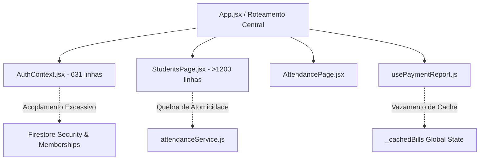

# EOS ARTIFACTS 24 a 35: RESILIÊNCIA, DÍVIDA TÉCNICA, ANÁLISE DE RISCOS E MATURIDADE ARQUITETURAL

**Sistema:** Atlas Academy (SaaS Multi-Tenant)  
**Módulos:** `System` & `Site`  
**Metodologia:** EOS (Engineering Operating System) Audit Gate  
**Modo:** `REVIEW_READ_ONLY` (Evidence-First)  
**Data:** 09/09/2026  

---

## ARTIFACT-24: Error Handling & Resilience Pattern (Padrões de Tratamento de Erro e Resiliência)

| Cenário de Falha | Tratamento Atual no Código | Resiliência Observada | Recomendação Técnica |
| :--- | :--- | :---: | :--- |
| **Queda de Conexão de Rede** | Firestore SDK gerencia cache offline via IndexedDB (`persistentLocalCache`). | **ALTA** | Manter o cache local; adicionar indicador visual de sincronização pendente na UI. |
| **Erro de Permissão no Firestore (`permission-denied`)** | Tratamento genérico com `console.warn` ou `console.error`; em alguns pontos (`useColecaoComTenant.js`), silenciado sem feedback ao usuário. | **BAIXA** | Implementar interceptor global ou Error Boundary capturando `permission-denied` e redirecionando para tela de acesso não autorizado amigável. |
| **Falha Parcial em Criação de Tenant** | Capturado por `try/catch` individual com log no console, propagando erro mas deixando recursos órfãos no banco. | **NULA** | Envolver as 3 gravações em uma transação atômica (`writeBatch` ou `runTransaction`). |
| **Crash Inesperado de Renderização em Componente React** | Não há React Error Boundaries (`ErrorBoundary`) envolvendo rotas principais em `App.jsx`. | **CRÍTICA** | Um único erro de renderização (ex.: `formatBR is not defined`) desmonta toda a árvore React, gerando tela branca permanente para o usuário. |

---

## ARTIFACT-25: Technical Debt Register (Registro Consolidado de Dívida Técnica)

| ID do Débito | Componente / Local | Descrição do Débito Técnico | Custo de Manutenção / Risco |
| :--- | :--- | :--- | :--- |
| **DEBT-01** | `AuthContext.jsx` (631 linhas) | Concentra autenticação Firebase, resolução multi-tenant, autorização de papéis, simulação de perfil, hashing fraco e resgate de tenants órfãos em um único arquivo. | Manutenção complexa; alto risco de regressões em segurança e login. |
| **DEBT-02** | `StudentsPage.jsx` (>1200 linhas) | Componente "Deus" acumulando listagem de alunos, filtros, modal de detalhes, modal de edição, controle de graduação e manipulação de visitantes. | Dificuldade extrema de leitura e testes; erros de lint (`formatBR is not defined`). |
| **DEBT-03** | `collections.js` & Hooks | Convivência de nomes de coleções e campos em português e inglês (`usuarios`/`students`, `chamadas`/`sessions`, `jornada_tecnica`/`tech_journey`). | Inconsistência conceitual; quebra de queries e incompatibilidade de relatórios. |
| **DEBT-04** | Ausência de TypeScript | Base de código inteiramente em JavaScript sem validação de tipos ou interfaces estáticas. | Erros comuns de digitação de propriedades (`student.tech_journey` vs `jornada_tecnica`) passam despercebidos até o runtime. |
| **DEBT-05** | Bundle JS Monolítico (4.2 MB) | Falta de divisão de código por rota (`React.lazy` / dynamic imports) no `App.jsx`. | Carregamento lento no mobile; penalização severa no Core Web Vitals (LCP > 3.5s em redes móveis). |

---

## ARTIFACT-26: Refactoring Candidates (Hotspots de Refatoração Prioritária)



1. **`AuthContext.jsx`**: Dividir em:
   - `AuthenticationProvider`: Exclusivamente sessão Firebase Auth e claims JWT.
   - `TenantMembershipProvider`: Exclusivamente mapeamento e troca de organizações.
   - `UserRoleGuard`: Exclusivamente autorização baseada em papéis.
2. **`StudentsPage.jsx`**: Decompor em componentes atômicos:
   - `StudentsTable.jsx`, `VisitorsList.jsx`, `StudentFilterBar.jsx`, `GraduationBadge.jsx`.
3. **`usePaymentReport.js`**: Eliminar `_cachedBills` global em favor de cache delimitado por React Query ou memoização indexada por `organizacaoAtualId`.

---

## ARTIFACT-27: Root Cause Analysis Matrix (Matriz de Causa Raiz)

| Sintoma / Falha Observada | Causa Imediata | Causa Raiz de Engenharia |
| :--- | :--- | :--- |
| **Credenciais de usuários expostas em logs e URLs** | `quiz.js` redireciona passando `?pin=...` na URL. | Ausência de fronteira de API/Backend entre o site público e a aplicação administrativa. |
| **Bypass de permissões administrativas por alunos** | `AuthContext.jsx` lê `rs_simulated_role` do `localStorage`. | Confiança indevida no cliente (Client-Side Enforcement) sem validação de autoridade no servidor. |
| **Cálculo de inadimplência incorreto à noite** | `new Date().toISOString().split('T')[0]` em `useFinance.js`. | Manipulação de datas e fusos horários sem padronização de timezone de negócio (América/São Paulo - UTC-3). |
| **Falha de tela branca em Visitantes** | `formatBR is not defined` em `StudentsPage.jsx:1217`. | Ausência total de suite de testes automatizados e merge de código sem bloqueio por linter (`eslint`). |

---

## ARTIFACT-28: Traceability Matrix (Matriz de Rastreabilidade EOS)

| Requisito de Negócio / Segurança | Implementação no Código | Controle de Segurança | Risco Associado | Status EOS |
| :--- | :--- | :--- | :--- | :---: |
| **Isolamento de Dados Multi-Tenant** | `organizations/{orgId}/*` | `firestore.rules` (`isOrganizationMember`) | Vazamento por cache global em memória (`usePaymentReport.js`) | ⚠️ CONDICIONAL |
| **Controle de Acesso Baseado em Papéis (RBAC)** | `effectiveRole` em `AuthContext.jsx` | `ProtectedRoute.jsx` | Bypass total por edição de `localStorage` | ❌ REJEITADO |
| **Proteção de Segredos e Autenticação** | `privado/segredos` | PINs em texto puro | Exposição de credenciais para qualquer membro staff | ❌ REJEITADO |
| **Registro de Frequência e Graduação** | `attendanceService.js` | `writeBatch` Firestore | Inconsistência em deleção e divergência de chaves de schema | ⚠️ CONDICIONAL |
| **Controle Financeiro e Mensalidades** | `useFinance.js` | `firestore.rules` (`faturas`) | Inadimplência precipitada após as 21h00 (UTC) | ⚠️ CONDICIONAL |

---

## ARTIFACT-29: Coupling & Cohesion Analysis (Acoplamento e Coesão)

- **Coesão Baixa nos Hooks de Domínio:** `useStudents.js` e `useFinance.js` realizam queries Firestore, formatação de UI, mutações e chamadas de logs diretamente no mesmo hook.
- **Acoplamento Forte com Firestore SDK:** Não existe repositório ou camada de abstração de dados (Ports and Adapters). A UI (`.jsx`) importa métodos de baixo nível do Firebase (`doc`, `collection`, `query`, `where`, `setDoc`), tornando qualquer migração ou teste de unidade inviável sem mocking complexo de toda a árvore do Firebase.

---

## ARTIFACT-30: Hidden Risk Register (Registro de Riscos Ocultos)

1. **Exaustão de Quota e Custos do Firestore em Collection Groups:** Consultas `collectionGroup('members')` e `collectionGroup('presencas')` sem filtros estritos de paginação e data disparam leituras massivas à medida que o banco cresce, podendo gerar picos de fatura do Google Cloud.
2. **Limite de 500 Operações por Batch:** `attendanceService.js:markAttendanceBatch` executa até 2 operações por aluno (registro de presença + incremento no usuário). Em turmas ou eventos com mais de 240 participantes, a chamada excede o limite atômico do Firestore (500 writes) e falha com exceção fatal.
3. **Invalidação de Sessão em Desligamento de Membro:** Se um gestor for desativado na subcoleção `members/{uid}`, o token JWT do Firebase Auth permanece válido por até 1 hora, permitindo que ele continue chamando APIs até que o token expire.

---

## ARTIFACT-31: System Maturity Scorecard (Scorecard de Maturidade EOS)

```
Níveis EOS:
0 - Inexistente / Caótico
1 - Básico / Inicial
2 - Funcional / Parcialmente Padronizado
3 - Maduro / Estruturado
4 - Enterprise / Resiliente

┌────────────────────────────┬───────┬────────────────────────────────────────┐
│ Dimensão de Engenharia     │ Nível │ Diagnóstico Real                       │
├────────────────────────────┼───────┼────────────────────────────────────────┤
│ Arquitetura & Modularidade │ 2.0   │ Multi-tenant implementado, mas acoplado│
│ Segurança & Gestão de Auth │ 0.5   │ PINs em texto plano e bypass client    │
│ Governança de Dados        │ 1.5   │ Subcoleções consistentes, sem schemas  │
│ Testes Automatizados       │ 0.0   │ Nenhuma linha de teste existente       │
│ Qualidade Estática (Lint)  │ 0.5   │ 347 erros de lint em src               │
│ CI/CD & Deploy Contínuo    │ 0.0   │ Inexistente                            │
│ Observabilidade & APM      │ 1.0   │ Apenas logs de atividade no Firestore  │
│ Performance & Core Web Vit.│ 1.5   │ Bundle único de 4.2 MB sem code split  │
├────────────────────────────┼───────┼────────────────────────────────────────┤
│ PONTUAÇÃO GERAL EOS        │ 0.88  │ NÍVEL INICIAL (RISCO ELEVADO)          │
└────────────────────────────┴───────┴────────────────────────────────────────┘
```

---

## ARTIFACT-32: Risk-Based Priority Matrix (Matriz de Prioridade de Remediação)

| Prioridade | ID do Finding | Ação de Remediação Obrigatória | Esforço | Impacto |
| :--- | :--- | :--- | :---: | :---: |
| **P0 (Imediato)** | SEC-01 | Remover transmissão de PIN em query string de URL no `Site/js/quiz.js`. | Baixo | Crítico |
| **P0 (Imediato)** | SEC-03 | Eliminar a leitura incondicional de `rs_simulated_role` do `localStorage` no `AuthContext.jsx`. | Baixo | Crítico |
| **P0 (Imediato)** | BUG-01 | Corrigir variáveis indefinidas que crasham o React (`formatBR` em `StudentsPage.jsx` e `doc` em `billingAdjustment.js`). | Baixo | Alto |
| **P1 (Urgente)** | SEC-02 | Migrar armazenamento de senhas/PINs para hashing seguro (Argon2id/bcrypt) ou remover segredos em texto plano do Firestore. | Médio | Crítico |
| **P1 (Urgente)** | SEC-04 | Corrigir `firestore.rules` para bloquear acesso de professores a segredos e e-mails pessoais hardcoded. | Baixo | Alto |
| **P1 (Urgente)** | SEC-06 | Particionar o cache global `_cachedBills` por `organizacaoAtualId` em `usePaymentReport.js`. | Baixo | Alto |
| **P1 (Urgente)** | RISK-03 | Corrigir bug de fuso horário em `useFinance.js` utilizando timezone `America/Sao_Paulo`. | Baixo | Médio |
| **P2 (Importante)**| QA-01 | Sanar os 347 erros de ESLint e configurar Vitest para testes unitários de domínio. | Médio | Médio |
| **P2 (Importante)**| PERF-01 | Implementar code-splitting com `React.lazy` nas rotas do `App.jsx` para reduzir bundle de 4.2 MB. | Médio | Médio |
| **P3 (Evolutivo)** | CI-01 | Configurar pipeline GitHub Actions com `npm run lint`, `npm test` e `npm run build`. | Baixo | Médio |

---

## ARTIFACT-33: Next Steps & Safe Steps (Próximo Menor Passo Seguro)

1. **Apresentar o Relatório Consolidado de Auditoria ao Usuário** em modo `REVIEW_READ_ONLY`.
2. **Aguardar autorização formal explícita** antes de efetuar qualquer alteração no código.
3. Após aprovação, executar a remediação P0 em branch de correção isolada:
   - Passo 1: Correção cirúrgica de `Site/js/quiz.js` (remoção do PIN da URL).
   - Passo 2: Remoção do bypass de autorização em `AuthContext.jsx`.
   - Passo 3: Correção do `ReferenceError: formatBR` em `StudentsPage.jsx`.

---

## ARTIFACT-34: Residual Risk Register (Registro de Riscos Residuais)

Mesmo após a aplicação das correções P0 e P1, o sistema manterá riscos residuais inerentes à ausência de um backend dedicado:
- O frontend continuará interagindo diretamente com o Firebase SDK sem uma camada de validação intermediária de regras complexas de cobrança.
- A ausência temporária de testes automatizados significa que qualquer alteração subsequente deve ser minuciosamente validada de forma manual até a implantação de testes de regressão.

---

## ARTIFACT-35: Final Engineering Audit Verdict (Veredito Final de Engenharia EOS)

### VEREDITO: **REJECTED (REPROVADO PARA PRODUÇÃO SEM REMEDIAÇÃO DOS ITENS P0)**

**Justificativa Técnica Baseada em Evidências:**
O sistema Atlas Academy apresenta uma base arquitetural moderna (React 19 + Tailwind v4 + isolamento multi-tenant por subcoleções do Firestore bem estruturado conceitualmente), porém **viola controles fundamentais de segurança, integridade e conformidade**:
1. Vazamento ativo de senhas na URL (`Site/js/quiz.js:421`).
2. Armazenamento de credenciais em texto puro no Firestore (`AuthContext.jsx:349`).
3. Falha primária de autorização permitindo elevação de privilégio por console do navegador (`AuthContext.jsx:67`).
4. Erros de execução que travam a interface de alunos (`StudentsPage.jsx:1217`).

O sistema **não está tecnicamente apto para operação em larga escala com dados reais de clientes** sem a remediação prévia e imediata dos achados classificados como **P0**.
